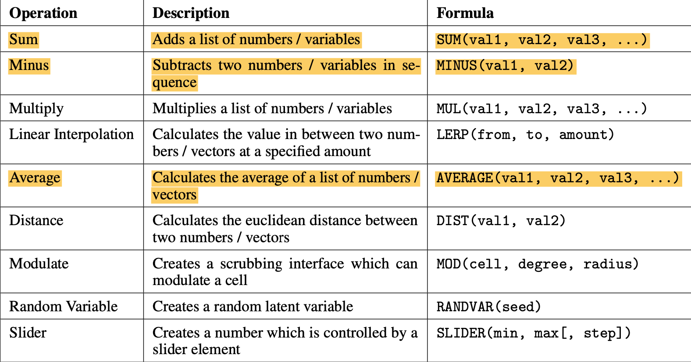
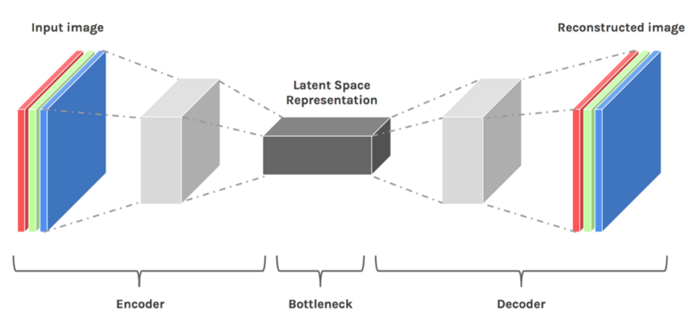
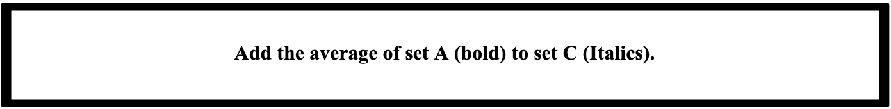
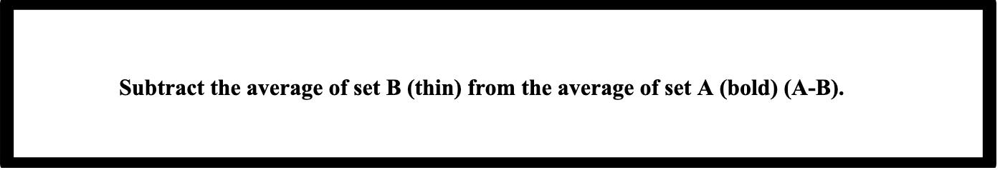
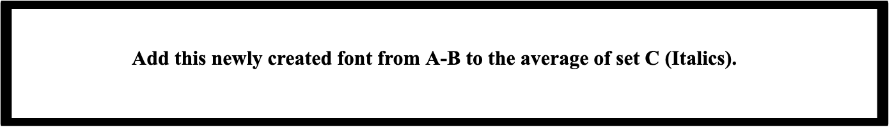

# a7-spacesheets
by Alyssa Hogan and Drew Kotarski 

written for *Practical Machine Learning for Liberal Arts* at Emmanuel College 2022 with Professor Mark Sherman

**Introduction:**

The SpaceSheet is a spreadsheet interface that allows for the exploration of latent space through the use of a data picker. The data picker allows the latent variables, or the individual squares of fonts, to be interacted with through operations such as average, minus, sum etc. The variables have already been picked as seen in the grid on the left. [^1]

[^1]: Loh, B., &amp; White, T. (2018). SpaceSheets: Interactive Latent Space Exploration through a Spreadsheet Interface (thesis). SpaceSheet. Retrieved May 25, 2022, from https://vusd.github.io/spacesheet/. 

Using the SpaceSheet, this assignment looks at the relationships between variables through vector arithmetic. Each of the functions is a different vector arithmetic and produces a different result, decoded into an empty square. [^2]

[^2]: Loh, B., &amp; White, T. (2018). SpaceSheets: Interactive Latent Space Exploration through a Spreadsheet Interface (thesis). SpaceSheet. Retrieved May 25, 2022, from https://vusd.github.io/spacesheet/. 

LINK TO SPACESHEETS: http://bryanlohjy.gitlab.io/spacesheet/colours.html 

**Part 1 Directions:**

Use the first half of the assignment to get a better understanding of how the SpaceSheets work. For practice we will start on the colors tab. This was done to demonstrate how each square has its own characteristic which affects the function when applied to other characteristics.  

The SpaceSheet was created to show the relationship between data points in latent space using various operations. These operations can be seen on the top of the screen in the gray boxes labeled “average” “lerp” etc. For the purpose of this assignment we will be focusing on average, minus and sum. 

The basics of understanding the SpaceSheet are as follows: [^3]

**ADD A COLOR**: click an empty box then the color you want to add 

**USE A FUNCTION**: click on a different empty box in the grid, then press the function you want to use. The function should show up with an open parenthesis, then click the colors you want to apply the function to, ensuring that you delete any extraneous commas and close the parenthesis when the formula is complete

**AVERAGE:** no limit to the amount of squares that can be added together 

**SUM**: no limit however multiple combinations often make the box turn white

**MINUS:** exactly two colors,  like regular subtraction, the order of the colors will impact the result (eg. red-green yields a different result than green-red)

**CHART:** shows all the functions and the math behind them, although only the ones highlighted matter for this assignment. [^4]

[^3]: Loh, B., &amp; White, T. (2018). SpaceSheets: Interactive Latent Space Exploration through a Spreadsheet Interface (thesis). SpaceSheet. Retrieved May 25, 2022, from https://vusd.github.io/spacesheet/. 
[^4]: Loh, B., &amp; White, T. (2018). SpaceSheets: Interactive Latent Space Exploration through a Spreadsheet Interface (thesis). SpaceSheet. Retrieved May 25, 2022, from https://vusd.github.io/spacesheet/. 

**Part 1 Problem Set:** 

1. For each of the following, hypothesize what will happen, then do the operation, describe what happens and why you think you got that result. Attach a screenshot of your SpaceSheet.
   - Use the sum function on two similar colors
   - Use the sum function on two dissimilar colors
   - Use the minus function on two similar colors
   - Use the minus function on two dissimilar colors 
   - Switch the order of one of the minus pairs 

2. Make three groups of 6 colors. They can be based on whatever you prefer (color, shade,  brightness, etc). Use the average feature to get the average of each of the groups. You should have 3 new colors. What were the group categories? How did the category impact the average? What happens if the new colors are averaged? Attach a screenshot of your SpaceSheet. 

**Part 2 Directions**

In the warmup section Addition/Subtraction we explored the result of  applying these operations with our input data (colored squares). In the next warmup section Average Arrays we explored this idea of groups of colored squares that have similar characteristics and those averages.
The goal of part 2 of this assignment is to use the addition, subtraction, groups, and averages to extract meaningful information from the latent space and explore how we can apply this meaning.

To begin, the colored squares weren’t a part of the latent space, but they did help get some major ideas of the latent space across. To put it simply, the latent space is a representation of compressed data. Compressed data helps machine learning in understanding important information. For example, a fully convolutional network learns important features of an image at each layer. From each layer to layer the convolutional network compresses the dimensionality of the image, to extract certain high- and low-level features. Since the model must reconstruct an image with the compressed data it must learn to store relevant information that corresponds to important features. The latent space representation of data contains all the information such as important features that are needed to represent the original data. [^5]

[^5]: Loh, B. J. Y. (2018). Spacesheets: Design Experimentation In Latent Space (thesis). 

 [^6]

[^6]: Tiu, E. (2020, February 4). Understanding latent space in machine learning. Medium. Retrieved June 28, 2022, from https://towardsdatascience.com/understanding-latent-space-in-machine-learning-de5a7c687d8d 

Each individual font chosen from the data-picker is a latent variable that contains a latent space vector that is visually decoded to be meaningful to us. The process of adding and subtracting fonts creates an operational effect of adding or subtracting two vectors. The two vectors sum or difference, is a new position in the latent space. That location is known as a latent space variable. The latent space variable then can be decoded into a meaningful image. In this case it was a new font.

The same process is applied to averaging fonts. Each font has a latent space variable which can be thought of as a position in the latent space. That position in the latent space is contained in a vector. By averaging a group of these vectors, a new vector is created that stores a position in the latent space. Decoding the new position from the latent space creates an average image of the fonts.

**Part 2 Problem Set:**

Respond to the questions below the bold boxes correlating to the directions. 

 
Hypothesize what each outcome will look like before the average. What are common trends among the results? Are there any results that are surprising?  Describe what you see.

Predict what will happen. Was the outcome what you thought? Why or why not?  Describe what you see.

 
Do you have a hypothesis for what happened in the latent space? Can you describe what you see? Were you surprised by the result?

By subtracting B from A not only did we create a new font, but we also created a new position in the latent space. This new position vector from the difference is called the attribute vector

Describe what you see. What do you think happened in the latent space? Go back to part 1 question B, do these two fonts look similar? Why do you think this is the case? Hypothesize the effect of subtracting A-B and applying that difference to set C does?

